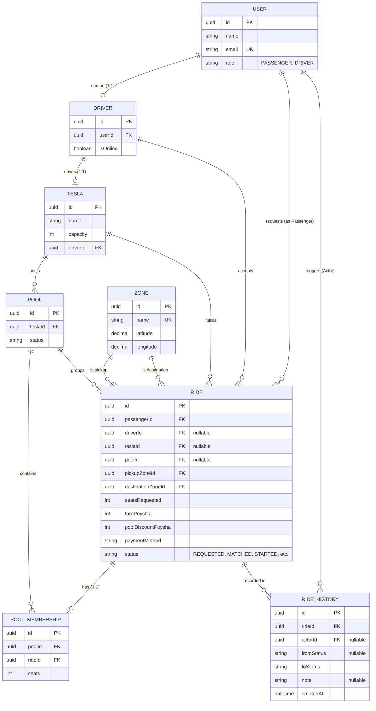

# Dhaka Tesla Pool: Entity Relationship Diagram

This document outlines the core relational data model for the Dhaka Tesla Pool. The database is designed to enforce strict ownership, ensure reliable audit trails, and safely manage pooling capacity constraints.

## ERD Diagram

## Key Relational Rules

- **Polymorphic Users**: The `User` table holds identity. A user becomes a driver by having a linked `Driver` record.
- **Pooling**: A `Pool` belongs to a specific `Tesla`. When a `Ride` is accepted, it is assigned a `poolId` and a `PoolMembership` record is generated to lock in the seat count used at that exact moment.
- **Audit Logging**: The `RideHistory` table is an append-only log. Every status change in a `Ride` must insert a row into `RideHistory`, capturing the `actorId` (the User who triggered the change) to trace actions reliably.
- **Fare Modeling**: Fares are stored defensively as integers (`farePoysha` and `poolDiscountPoysha`) to eliminate floating-point rounding errors during currency calculations.